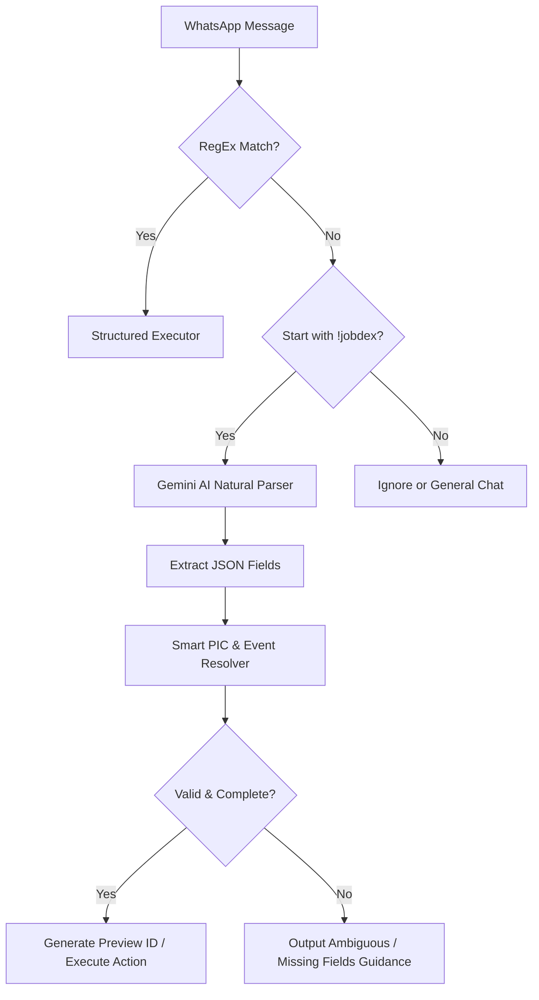

# WhatsApp Natural Language Command Layer - JobDex.in

Dokumen ini menjelaskan rancangan, spesifikasi, dan implementasi dari **Natural Language Command Layer** (Fase 22D) untuk WhatsApp Bot JobDex.in. Fitur ini dirancang untuk mempermudah koordinator dan anggota melakukan manajemen tugas secara cepat dan natural, tanpa harus bolak-balik membuka dashboard web atau menghafalkan format command terstruktur yang kaku.

---

## 1. Overview & Arsitektur Sistem

Sistem WhatsApp Bot menggunakan model asisten berbasis hybrid:
1. **Rule-Based Parsing (RegEx)**: Dicoba pertama kali untuk menangkap perintah kaku berformat tepat (seperti `!jobdex tambah jobdesk \n tipe: ...` atau `!jobdex update status [nama] menjadi [status]`).
2. **AI Fallback Parsing (Gemini API)**: Jika format input bertipe natural (tidak lolos regex), input dikirim ke Gemini untuk dinormalisasi menjadi parameter JSON terstruktur.
3. **Rule-Based Execution & Validation (Deterministic)**: Parameter JSON hasil parsing AI diproses oleh backend dengan validasi keamanan (RBAC), pencarian entitas (PIC & Event Resolver), dan data-handling yang sepenuhnya terkendali. AI **tidak diperbolehkan** langsung menulis ke database atau mengarang data.

### Alur Data WhatsApp Command Natural:


---

## 2. Daftar Command Natural & Contoh Input

Berikut adalah command natural baru yang didukung dengan format prefix `!jobdex`:

### A. Tambah Jobdesk Natural (Single Creation)
*   **Contoh Input**:
    *   `!jobdex tambah jobdesc desain pamflet opening ke Agus deadline 20 Juni`
    *   `!jobdex buat tugas untuk 08123456789: desain feed pembukaan, tenggat besok malam`
    *   `!jobdex tugaskan Agus DJ buat poster sponsor deadline Jumat`
*   **Role**: `super_admin`, `koordinator_divisi`, `koordinator_acara` (hanya untuk acara miliknya).
*   **Aturan**:
    *   Jika dikirim dari WhatsApp Group yang sudah terhubung ke event, bidang `type` otomatis diisi `acara` dan `event_id` otomatis terisi dari database event.
    *   Fuzzy match untuk PIC (dapat menggunakan nama lengkap, nickname, alias, atau nomor WhatsApp).
    *   Jika prioritas tidak ditentukan, otomatis diset `sedang`. Namun jika mengandung kata-kata urgent (seperti *urgent*, *hari ini*, *besok*, *segera*, *penting*, *kritis*, *cepat*, *darurat*), prioritas otomatis dinaikkan menjadi `tinggi`.
    *   Auto checklist dibuat berdasarkan kategori tugas.
    *   Menghasilkan Preview ID (misal: `JBD82K`) yang memerlukan konfirmasi sebelum ditulis ke database.

### B. Bulk Jobdesk Natural
*   **Contoh Input**:
    ```txt
    !jobdex buat jobdesc RAKER:
    1. Agus desain pamflet opening deadline 20 Juni
    2. Dika dokumentasi kegiatan deadline 21 Juni
    3. Ayu buat caption publikasi deadline besok
    4. Komang upload live report saat acara
    ```
*   **Role**: `super_admin`, `koordinator_divisi`, `koordinator_acara` (hanya untuk acara miliknya).
*   **Aturan**:
    *   Membaca nama acara dari header teks (misal: `RAKER`). Jika dikirim dari grup event terhubung, acara otomatis terdeteksi dari grup.
    *   Mendeteksi setiap baris sebagai satu task terpisah.
    *   Melakukan resolve PIC, deadline, dan prioritas untuk setiap baris.
    *   Menggunakan prinsip **All-or-Nothing**: Jika ada satu task yang memiliki PIC ambigu/tidak ditemukan atau deadline tidak terbaca, preview tetap dibuat tetapi diberi tanda peringatan (warning) dan tombol/command konfirmasi diblokir sampai data diperbaiki.
    *   Menghasilkan Preview ID bulk (misal: `BLK91A`).

### C. Update Status Natural
*   **Contoh Input**:
    *   `!jobdex feed opening sudah mulai aku kerjakan` (Status: `sedang_dikerjakan`)
    *   `!jobdex pamflet opening sudah 70%, tinggal revisi warna` (Status: `revisi_dikerjakan`)
    *   `!jobdex banner stuck, file logo belum dikirim` (Status: `stuck`, catatan: "file logo belum dikirim")
    *   `!jobdex caption publikasi nunggu materi dari panitia` (Status: `menunggu_materi`, catatan: "nunggu materi dari panitia")
*   **Role**:
    *   `anggota` (hanya boleh update task miliknya sendiri/PIC).
    *   `super_admin`, `koordinator_divisi` (sesuai scope divisi), `koordinator_acara` (sesuai scope acara).
*   **Mapping Status**:
    *   mulai / sedang dikerjakan / on progress / proses / gas $\rightarrow$ `sedang_dikerjakan`
    *   stuck / macet / terkendala / kendala $\rightarrow$ `stuck`
    *   nunggu materi / belum ada redaksi / menunggu bahan $\rightarrow$ `menunggu_materi`
    *   draft jadi / draft selesai / draft sudah ada $\rightarrow$ `draft_selesai`
    *   sudah upload / sudah kirim link / hasil sudah dikirim $\rightarrow$ `menunggu_approval`
    *   revisi sudah dikerjakan / revisi selesai $\rightarrow$ `revisi_dikerjakan`
    *   ditunda / pending dulu $\rightarrow$ `ditunda`
*   **Aturan**: Jika status diubah menjadi `stuck`, `butuh_bantuan`, atau `menunggu_materi`, catatan kendala wajib disertakan.

### D. Revisi Natural
*   **Contoh Input**:
    *   `!jobdex revisi pamflet opening, logo terlalu kecil dan tanggal kurang jelas`
    *   `!jobdex pamflet opening revisi ya, warna background terlalu gelap`
    *   `!jobdex feed sponsor minta revisi, font sponsor kurang kebaca`
*   **Role**: `super_admin`, `koordinator_divisi` (sesuai scope divisi), `koordinator_acara` (sesuai scope acara). `anggota` ditolak.
*   **Aturan**:
    *   Mencari task berdasarkan kemiripan judul atau kode.
    *   Jika ditemukan tepat satu task cocok, status otomatis berubah menjadi `perlu_revisi` dan `revision_notes` disimpan dengan catatan yang diberikan.
    *   Jika ambigu (lebih dari satu task cocok), bot akan menyajikan opsi tugas kandidat.

### E. Approve / ACC Natural
*   **Contoh Input**:
    *   `!jobdex acc pamflet opening`
    *   `!jobdex approve desain feed opening`
    *   `!jobdex pamflet opening sudah oke, approve`
    *   `!jobdex feed sponsor aman, acc`
*   **Role**: `super_admin`, `koordinator_divisi` (sesuai scope divisi), `koordinator_acara` (sesuai scope acara). `anggota` ditolak.
*   **Aturan**:
    *   Mencari task berdasarkan nama/kode.
    *   Jika cocok satu, menyetujui tugas secara instan (mengubah status menjadi `approved` dan status approval menjadi `approved`).

---

## 3. Entitas Resolvers & Penanganan Data

### A. Smart PIC Resolver
Fungsi `resolvePIC` diprogram untuk memetakan nama input ke user di database berdasarkan kriteria berikut:
1.  **Prioritas 1 (Exact Match Nomor WhatsApp)**: Format nomor telepon internasional (`628...`) atau lokal (`08...`).
2.  **Prioritas 2 (Exact Match Nickname)**: Berdasarkan field `nickname` pada profil pengguna.
3.  **Prioritas 3 (Exact Match Aliases)**: Berdasarkan array `aliases` pada profil pengguna.
4.  **Prioritas 4 (Exact Match Nama Lengkap)**: Berdasarkan field `name` pengguna.
5.  **Prioritas 5 (Fuzzy Match Nama/Nickname/Alias)**: Menggunakan substring search yang tidak sensitif terhadap huruf besar/kecil.

Jika ditemukan **lebih dari satu kandidat** (misalnya memasukkan "Agus" dan terdapat "Putu Agus" dan "Agus Aditya"), bot akan mengembalikan status `PIC Ambigu` beserta daftarnya untuk meminta user memasukkan nama yang lebih lengkap atau nomor WhatsApp.

### B. Auto Checklist Generator
Kategori checklist otomatis dideteksi berdasarkan judul/deskripsi tugas:
*   **Desain Publikasi** (*pamflet, poster, flyer, feed, story, banner, spanduk, publikasi, desain*):
    1. Redaksi/materi tersedia
    2. Referensi desain tersedia
    3. Draft desain
    4. Revisi internal
    5. Finalisasi ukuran
    6. Upload hasil
*   **Dokumentasi** (*dokumentasi, foto, video, highlight, recap, aftermovie*):
    1. Brief dokumentasi dibaca
    2. Ambil footage/foto
    3. Seleksi file
    4. Editing
    5. Review internal
    6. Upload final
*   **Copywriting** (*caption, copywriting, narasi, teks publikasi, press release*):
    1. Pahami brief
    2. Draft tulisan
    3. Review bahasa
    4. Finalisasi
    5. Kirim ke desainer/admin
*   **Administrasi** (*surat, undangan, proposal, lpj, rab, daftar hadir*):
    1. Data kebutuhan lengkap
    2. Draft dokumen
    3. Review koordinator
    4. Revisi dokumen
    5. Finalisasi
    6. Upload/arsipkan
*   **Umum (Default)**: Jika tidak ada keyword di atas yang cocok, gunakan checklist umum 6 item bawaan sistem.

### C. Auto Cari Referensi Desain
Saat membuat preview jobdesk yang terdeteksi sebagai jenis **Desain Publikasi**, bot akan secara otomatis mencari database `design_references` menggunakan pencarian kata kunci dan menyarankan hingga **3 referensi terdekat** di dalam pesan preview sebagai saran.

---

## 4. Smart Follow-up Reminder Rules
Sistem berjalan via cron harian untuk mendeteksi tugas-tugas kritis dan mengirim pengingat tertarget demi mencegah lupa update:
1.  **H-3 belum dimulai**: Mengirim reminder personal ke PIC agar segera memulai tugas.
2.  **H-1 belum approval/selesai**: Mengirim reminder personal ke PIC (Urgent) agar segera menyelesaikan tugas.
3.  **Stuck > 12 jam**: Mengirim alert ke grup acara/divisi agar koordinator dapat memberikan bantuan.
4.  **Menunggu Materi > 1 hari**: Mengirim alert ke grup acara/divisi untuk memperingatkan pembuat tugas/koordinator.
5.  **Menunggu Approval > 1 hari**: Mengirim reminder ke koordinator agar segera memeriksa hasil pekerjaan.
6.  **Tidak ada update 2 hari**: Dimasukkan ke laporan laporan `siapa belum update` mingguan/harian.

*Catatan*: Menggunakan pencatatan histori `whatsapp_logs` dengan kriteria penandaan unik untuk memastikan tidak terjadi spam pengingat ganda (anti-duplicate).

---

## 5. Ringkasan Laporan Koordinator (Daily Briefing)
Command `!jobdex briefing` diubah formatnya agar lebih ringkas, padat, dan *actionable* bagi koordinator:
```txt
[*JobdexIn* Briefing Koor]

RAKER 2026 — Ringkasan Hari Ini

Perlu dicek:
🔴 2 overdue
🟡 3 deadline H-1/H-2
⚠️ 1 stuck
⏳ 2 menunggu approval
📝 4 belum update 2 hari

Aksi cepat:
- !jobdex siapa belum update
- !jobdex tugas overdue
- !jobdex menunggu approval
```

---

## 6. Guardrail Keamanan & Kebijakan RBAC
*   **Hak Akses Write**: Hanya role `super_admin`, `koordinator_divisi`, dan `koordinator_acara` yang diperbolehkan membuat, merevisi, mengarsip, atau menyetujui tugas. Perintah write dari role `anggota` akan ditolak.
*   **Kepemilikan Preview**: Tombol/command konfirmasi (`!jobdex konfirmasi [PREVIEW_ID]`) wajib memvalidasi bahwa pengirim adalah orang yang sama yang membuat draf preview tersebut.
*   **Penyaringan Data (Data Leakage Guard)**: Data briefing koordinator disaring sesuai dengan lingkup role-nya. Anggota biasa hanya dapat menggunakan command `!jobdex tugas saya`.
